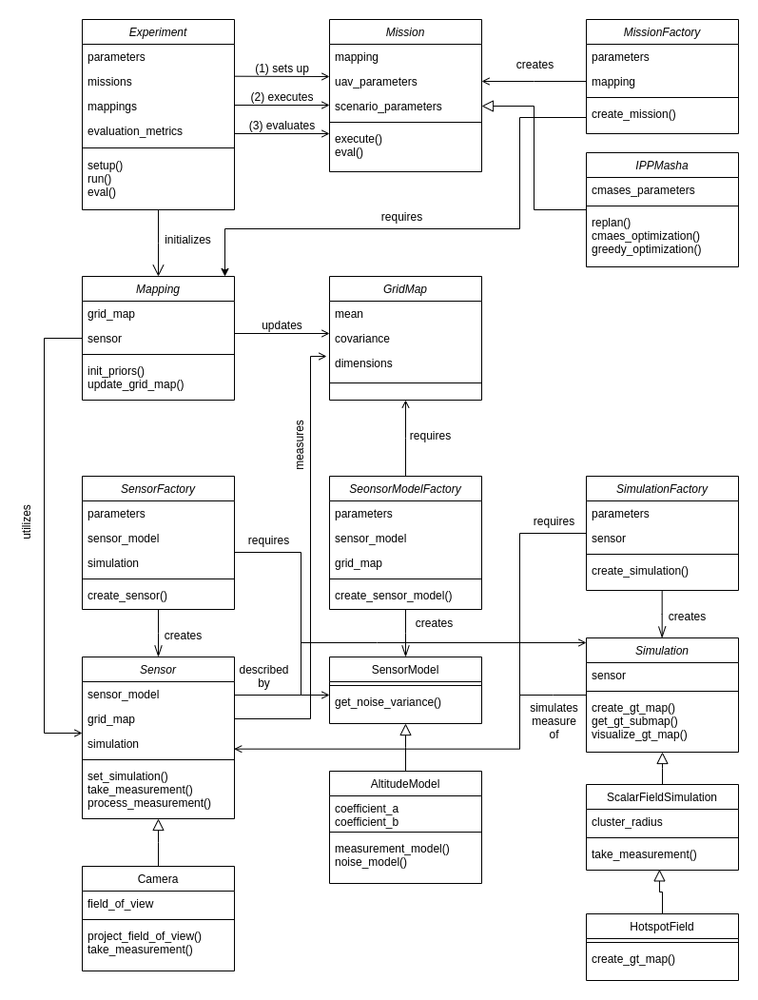

# Adaptive Informative Path Planning Using Deep Reinforcement Learning for UAV-based Active Sensing

Aerial robots are increasingly being utilized for
environmental monitoring and exploration. However, a key
challenge is efficiently planning paths to maximize the information value of acquired data as an initially unknown
environment is explored. To address this, we propose a new
approach for informative path planning based on deep reinforcement learning (RL). Combining recent advances in RL and
robotic applications, our method combines tree search with an
offline-learned neural network predicting informative sensing
actions. We introduce several components making our approach
applicable for robotic tasks with high-dimensional state and
large action spaces. By deploying the trained network during a
mission, our method enables sample-efficient online replanning
on platforms with limited computational resources. Simulations
show that our approach performs on par with existing methods
while reducing runtime by 8−10×. We validate its performance
using real-world surface temperature data.

The paper can be found [here](https://arxiv.org/pdf/2109.13570.pdf). If you found this work useful for your own research, feel free to cite it.
```commandline
@article{ruckin2021adaptive,
  title={Adaptive Informative Path Planning Using Deep Reinforcement Learning for UAV-based Active Sensing},
  author={R{\"u}ckin, Julius and Jin, Liren and Popovi{\'c}, Marija},
  journal={arXiv preprint arXiv:2109.13570},
  year={2021}
}
```

## Installation

The installation is based on Docker for easy transferability between different hardware setups.
Furthermore, for smooth deployment, a docker-compose setup is established.
Please make sure to install [Docker](https://docs.docker.com/get-docker/) and [docker-compose](https://docs.docker.com/compose/install/). 
Please make sure you have installed at least docker-compose 1.26 (`docker-compose --version` for version information). To upgrade docker-compose to the latest version, have a look at [this Stack Overflow post](https://stackoverflow.com/questions/49839028/how-to-upgrade-docker-compose-to-latest-version).

For installation of the framework, run:
```commandline
./build.sh
```

## Usage

Create a file named `.env` in the top-level repo directory to make configurable environment variables accessible to the docker containers.
Within the `.env` file the following env-variables are defined:
```commandline
REPO_DIR=/path/to/your/repo/ipp-rl/ # mandatory, absolute path on host machine
CONFIG_FILE_PATH=path/in/repo/to/config/file.yaml # optional, if not set use default: 'config/example.yaml'
LOG_DIR=subfolder/for/storing/logs/ # optional, if not set use default: 'logs'
```

To execute the framework, run:
```commandline
./run.sh
```

To stop the execution, run:
```commandline
./stop.sh
```

Each run's logs are stored in a separate and timestamped logfile in the specified `LOG_DIR`.

## Software Architecture



## Development

### Style Guidelines

In general, we follow the Python [PEP 8](https://www.python.org/dev/peps/pep-0008/) style guidelines. Please install [black](https://pypi.org/project/black/) to format your python code properly.
To run the black code formatter, use the following command:

```commandline
black -l 120 path/to/python/module/or/package/
```

To optimize and clean up your imports, feel free to have a look at this solution for [PyCharm](https://www.jetbrains.com/pycharm/guide/tips/optimize-imports/).

## Funding

This work was funded by the Deutsche Forschungsgemeinschaft (DFG,
German Research Foundation) under Germany’s Excellence Strategy - EXC
2070 – 390732324. Authors are with the Cluster of Excellence PhenoRob,
Institute of Geodesy and Geoinformation, University of Bonn.
